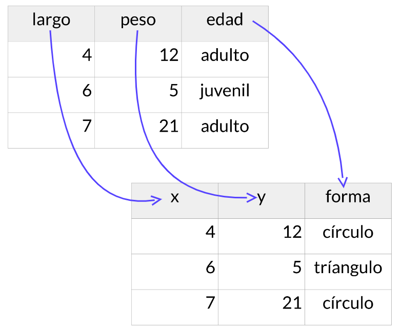
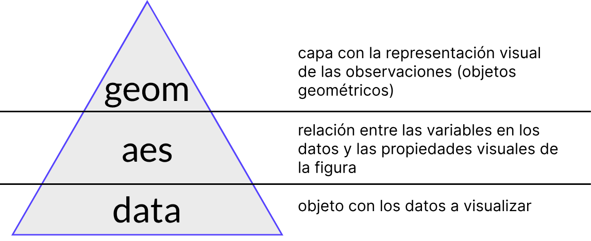
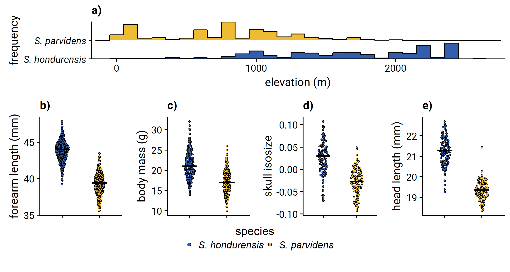
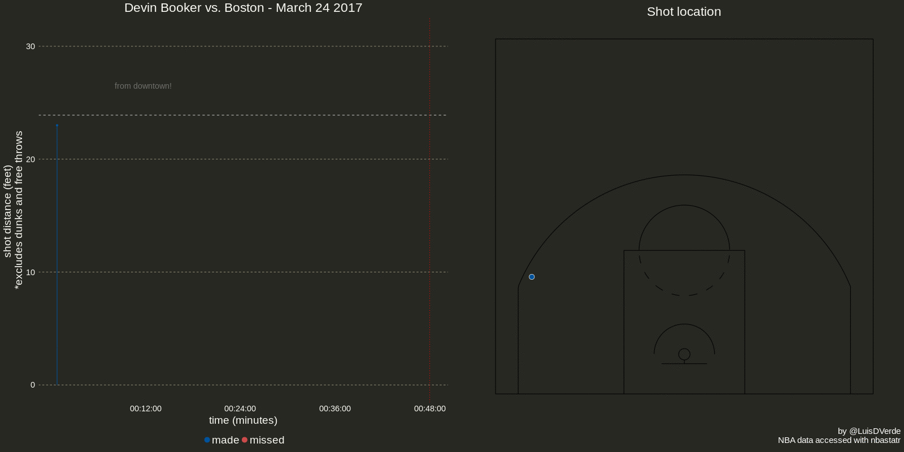

```{r imgs setup, echo=FALSE, eval=TRUE}
knitr::opts_chunk$set(fig.retina = 3, warning = FALSE, message = FALSE)
```

```{r, echo=FALSE, eval=TRUE, out.width="66%", fig.align='center'}

```

---

class: center, middle
```{r, echo=FALSE, eval=TRUE, out.width="86%", fig.align='center'}

```

---
class: center, middle
```{r, echo=FALSE}
library(tibble)
library(ggplot2)
lag <- tibble(largo=c(4,6,7),peso=c(12,5,21),
              edad=c("adulto","juevnil","adulto"))
mapeado <- tibble(largo=c(4,6,7),peso=c(12,5,21),
              forma=c("círculo","triángulo","círculo"))
```

```{r, eval=FALSE}
ggplot(data=lag,aes(x=largo,y=peso,shape=edad))+
  geom_point()+
  scale_shape_manual(values=c(16,17,16))
```

---
class:center, middle
```{r, echo=FALSE}
ggplot(data=lag,aes(x=largo,y=peso,shape=edad))+
  geom_point()+
  scale_shape_manual(values=c(16,17,16))
```

---
class:center, middle
```{r, echo=TRUE, eval=FALSE}
ggplot(data=lag,aes(x=largo,y=peso,shape=edad))+
  geom_point(size=8)+
  scale_shape_manual(values=c(16,17,16))+
  theme_minimal(base_size = 22)
```

---

class:center, middle
```{r, echo=FALSE}
ggplot(data=lag,aes(x=largo,y=peso,shape=edad))+
  geom_point(size=8)+
  scale_shape_manual(values=c(16,17,16))+
  theme_minimal(base_size = 22)
```

---

# labs

rótulos para ejes, títulos, subtítulos

# themes
apariencias predefinidas para múltiples parámetros gráficos

# fill, shape, color
control sobre mapeos estéticos

---
class: center
<blockquote class="twitter-tweet"><p lang="en" dir="ltr"><a href="https://twitter.com/hashtag/MakingOf?src=hash&amp;ref_src=twsrc%5Etfw">#MakingOf</a> of last week&#39;s <a href="https://twitter.com/hashtag/TidyTuesday?src=hash&amp;ref_src=twsrc%5Etfw">#TidyTuesday</a> plot <a href="https://t.co/JGl9tLX2nX">https://t.co/JGl9tLX2nX</a> <a href="https://t.co/Dz7eRxNxuo">pic.twitter.com/Dz7eRxNxuo</a></p>&mdash; Georgios Karamanis (@geokaramanis) <a href="https://twitter.com/geokaramanis/status/1437402115186561031?ref_src=twsrc%5Etfw">September 13, 2021</a></blockquote> <script async src="https://platform.twitter.com/widgets.js" charset="utf-8"></script> 

---

# Extras para `ggplot2`

- Gráficos predeterminados, específicos a una disciplina
- **Paletas de colores**
- **geoms**
- **Utilidades adicionales**

---
class: chapter-slide

## ¿Cuántos paquetes en CRAN comienzan con "gg"?

---
```{r, message=FALSE, warning=FALSE, echo=FALSE}

# load packages -----------------------------------------------------------
library(dplyr)
library(stringr)
```

```{r}
p_db <- tools::CRAN_package_db()
p_db <- p_db %>% select(Package, Author, Description)
ggpkgs <- p_db %>%
  filter(str_detect(Package, "^gg"))
```

El 03/11/2021: 

`r nrow(ggpkgs)`

---

```{r, echo=FALSE}
cienpkgs <- dplyr::sample_n(ggpkgs,100) %>% pull(Package)
```
`r paste(cienpkgs)`

---

# Demostraciones

1. Paquetes con funciones geom

2. Funciones para acomodar figuras

3. Paletas y herramientas de colores

4. Herramientas útiles

---
## 1. geoms adicionales

### ggforce 
Accelerating 'ggplot2'

### ggalt 
Extra Coordinate Systems, 'Geoms', Statistical Transformations, Scales and Fonts for 'ggplot2'

### ggridges 
Ridgeline Plots in 'ggplot2'

---
# ggforce

.pull-left[
Thomas Lin Pedersen, https://ggforce.data-imaginist.com/
]

.pull-right[
```{r, echo=FALSE, eval=TRUE, out.width="86%", fig.align='right'}
knitr::include_graphics("https://raw.githubusercontent.com/thomasp85/ggforce/master/man/figures/logo.png")
```
]  


Fns `geom_mark` para agrupar objetos

`geom_sina` para mostrar puntos agrupados y la distribución de sus valores

---

class: center, middle
```{r, echo=FALSE, eval=TRUE, out.width="86%", fig.align='center'}

```

---

class: center
```{r, echo=FALSE, eval=TRUE, out.width="65%", fig.align='center'}
knitr::include_graphics("https://luisdva.github.io/assets/images/gghull.png")
```
https://luisdva.github.io/Agrupando-puntos/

---

<blockquote class="twitter-tweet"><p lang="en" dir="ltr">For my Intro to Data Science course <a href="https://twitter.com/hashtag/midterm?src=hash&amp;ref_src=twsrc%5Etfw">#midterm</a>, I made a cheat sheet of the <a href="https://twitter.com/hashtag/R?src=hash&amp;ref_src=twsrc%5Etfw">#R</a> package <a href="https://twitter.com/hashtag/ggforce?src=hash&amp;ref_src=twsrc%5Etfw">#ggforce</a>. Any constructive criticism would be much appreciated as I have only been coding for two months. 😬 Help me get better, <a href="https://twitter.com/hashtag/RStats?src=hash&amp;ref_src=twsrc%5Etfw">#RStats</a>! <a href="https://t.co/2SCPCZqb2c">pic.twitter.com/2SCPCZqb2c</a></p>&mdash; Amy Jones (@amymarie634) <a href="https://twitter.com/amymarie634/status/1456021661686325248?ref_src=twsrc%5Etfw">November 3, 2021</a></blockquote> <script async src="https://platform.twitter.com/widgets.js" charset="utf-8"></script> 

---
# `ggalt`

Bob Rudis, https://cran.r-project.org/web/packages/ggalt/vignettes/ggalt_examples.html

- Distribución de frecuencias (`geom_bkde`)
- Agrupar puntos (`geom_encircle`)
- Líneas suavizadas (`geom_xspline`)
- Paletas/chupetín (`geom_lollipop`)

---

```{r, echo=FALSE, eval=TRUE, out.width="99%", fig.align='center'}

```


---

# `ggridges`
Claus Wilke, https://wilkelab.org/ggridges/articles/introduction.html

geoms para comparar distribuciones de valores
- `stat="binline"` para histogramas

---

```{r, echo=FALSE, eval=TRUE, out.width="89%", fig.align='center'}
knitr::include_graphics("https://pbs.twimg.com/media/DlOktSPXcAEZiEA.jpg")
```
David Smale (https://davidsmale.netlify.app)

---
## 2. Funciones para acomodar figuras

### patchwork  
The Composer of Plots

### ggh4x 
Hacks for 'ggplot2'

---
# patchwork
.pull-left[
Thomas Lin Pedersen, https://patchwork.data-imaginist.com/
]

.pull-right[
```{r, echo=FALSE, eval=TRUE, out.width="76%", fig.align='right'}
knitr::include_graphics("https://raw.githubusercontent.com/thomasp85/patchwork/master/man/figures/logo.png")
```
]  

- Acomodar objetos gráficos (no solo de `ggplot`) y componer figuras complejas
- Rótulos, leyendas en común, elementos alineados
- `+` para juntar objetos

---

```{r, echo=FALSE, eval=TRUE, out.width="95%", fig.align='center'}
knitr::include_graphics("https://patchwork.data-imaginist.com/articles/guides/assembly_files/figure-html/unnamed-chunk-14-1.png")
```

---

### ggh4x 
.pull-left[
Teun van den Brand, https://github.com/teunbrand/ggh4x
]
.pull-right[
```{r, echo=FALSE, eval=TRUE, out.width="65%", fig.align='right'}
knitr::include_graphics("https://raw.githubusercontent.com/teunbrand/ggh4x/master/man/figures/logo_300px.png")
```
]

- _Eludiendo la gramática de gráficos_
- Facetas anidadas
- Facetas de distintos tamaños
 
---

# 3. Paletas y herramientas de colores

### scico
Colour Palettes Based on the Scientific Colour-Maps

### ggnewscale 
Multiple Fill and Colour Scales in 'ggplot2'

---
# scico
.pull-left[
Thomas Lin Pedersen, https://github.com/thomasp85/scico/
]

.pull-right[
```{r, echo=FALSE, eval=TRUE, out.width="65%", fig.align='right'}
knitr::include_graphics("https://raw.githubusercontent.com/thomasp85/scico/master/man/figures/logo.png")
```
]  

Implementa paletas de colores diseñandas por Fabio Crameri ([2018](https://www.fabiocrameri.ch/colourmaps/)). 
- Uniformes (en percepción)
- Imprimibles
- Aptos para daltónicos
- Disponibles con `scale_fill_scico`

---
class: center


---
# ggnewscale
.pull-left[
Elio Campitelli, https://eliocamp.github.io/ggnewscale/
]

.pull-right[
```{r, echo=FALSE, eval=TRUE, out.width="65%", fig.align='right'}
knitr::include_graphics("https://eliocamp.github.io/ggnewscale/reference/figures/logo.png")
```
]  

- Permite usar > 1 escalas (`fill`,`color`) en un mismo gráfico
- Util para figuras con varias capas y fuentes de datos

---

# 4. Herramientas útiles
### ggrepel 
Automatically Position Non-Overlapping Text Labels

### gghighlight
Highlight Lines and Points in 'ggplot2'

---

### ggeasy
Provides a series of aliases to commonly used but difficult to remember 'ggplot2' sequences

### ggfx
Filters that can be applied to layers from the 'ggplot2' package

---
# ggrepel
.pull-left[
Kamil Slowikowski,
https://github.com/slowkow/ggrepel
]

.pull-right[
```{r, echo=FALSE, eval=TRUE, out.width="65%", fig.align='right'}
knitr::include_graphics("https://raw.githubusercontent.com/slowkow/ggrepel/master/man/figures/logo.svg")
```
]  

- Rótulos que no se enciman

---

# gghighlight

Hiroaki Yutani   
https://yutannihilation.github.io/gghighlight/

- Énfasis en elementos gráficos

```{r, echo=FALSE, eval=TRUE, out.width="55%", fig.align='center'}
knitr::include_graphics("https://luisdva.github.io/assets/images/units.png")
```

---
# ggeasy
.pull-left[
Jonathan Carroll 
https://jonocarroll.github.io/ggeasy/]

.pull-right[
```{r, echo=FALSE, eval=TRUE, out.width="65%", fig.align='right'}
knitr::include_graphics("https://jonocarroll.github.io/ggeasy/reference/figures/logo.gif")
```
]

- Atajos para modificar parámetros gráficos con `easy_*`
- Argumento `teach` para mostrar las modificaciones al código

---

# ggfx
.pull-left[
Thomas Lin Pedersen, 
https://ggfx.data-imaginist.com/]

.pull-right[
```{r, echo=FALSE, eval=TRUE, out.width="65%", fig.align='right'}
knitr::include_graphics("https://raw.githubusercontent.com/thomasp85/ggfx/master/man/figures/logo.png")
```
]

- Filtros para elementos gráficos (sombras, brillo, desenfoque)
- Aplicados con `with_*`

---
class: chapter-slide

## ¡Gracias!

@LuisDVerde  
https://liomys.mx  
https://maevolab.mx/authors/luis/
